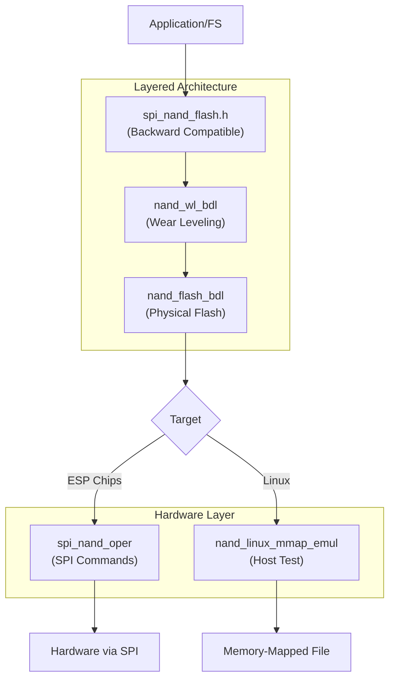

# SPI NAND Flash Driver

This driver is designed to support SPI NAND Flash with ESP chipsets.

This component incorporates the [dhara library](https://github.com/dlbeer/dhara) via the `espressif/dhara` component (vendored in-tree; no separate submodule checkout required), licenced under the [LICENCE](https://github.com/dlbeer/dhara/blob/master/LICENSE)

## About SPI NAND Flash
SPI NAND Flash combines the benefits of NAND Flash technology with the simplicity of the SPI interface, providing an efficient and cost-effective solution for non-volatile data storage in diverse applications. Its versatility, reliability, and affordability make it a popular choice for many embedded systems and electronic devices.

### Key Features:
* Non-Volatile Storage: SPI NAND Flash provides non-volatile storage, retaining data even when power is removed. This characteristic makes it ideal for storing critical system information and application data.

* SPI Interface: The SPI protocol allows for straightforward communication between the microcontroller and the NAND Flash. This simplicity in interface design facilitates easy integration into embedded systems.

* Cost-Effective: SPI NAND Flash offers a cost-effective storage solution, making it attractive for applications with budget constraints. Its competitive pricing makes it a viable option for a wide range of projects.

* High Density: NAND Flash technology inherently supports high-density storage, enabling the storage of large amounts of data in a compact form factor. This is advantageous for applications requiring extensive data storage in constrained spaces.

* Fast Read/Write Operations: The SPI interface enables reasonably fast read and write operations, making it suitable for applications where data access speed is crucial.

### Implementation Architecture

The component now features a layered architecture for better maintainability and modularity:



**Key Benefits:**
- **Backward Compatible**: Existing code works unchanged; sector-named APIs are retained as aliases of the page API
- **Page terminology**: Public API uses *page* (read_page, write_page, get_page_count, get_page_size) to align with NAND flash; sector names remain for compatibility
- **Modular Design**: Clear separation between wear-leveling and flash management
- **Enhanced Features**: Direct access to flash and wear-leveling layers

**📖 Architecture and migration:**
For layered architecture, BDL usage, API details, and **upgrading from 0.x to 1.0.0** (including the FATFS component split and legacy vs BDL init), see:
- [Layered Architecture Guide](layered_architecture.md) — includes the **Migration Guide (0.x → 1.0.0)** section

## ESP-IDF version and API modes

- **ESP-IDF 5.0–5.x:** Use the **legacy** API only (`spi_nand_flash_init_device()`, page/sector helpers). The BDL Kconfig option is not available on these IDF versions. Component **1.0.0** remains compatible with this range when BDL is not used.
- **ESP-IDF 6.0 and newer:** You may enable **`CONFIG_NAND_FLASH_ENABLE_BDL`** and use **`spi_nand_flash_init_with_layers()`** with **`esp_blockdev_t`** for block-device consumers. If BDL is **disabled**, the legacy API behaves as on older IDF versions.

**Linux mmap emulation (host tests):** On the Linux target, the driver can use a memory-mapped backing file instead of SPI hardware. Configuration examples and how to build the host test app live in [`host_test/README.md`](host_test/README.md).

## Supported SPI NAND Flash chips

At present, `spi_nand_flash` component is compatible with the chips produced by the following manufacturers and and their respective model numbers:

* Winbond - W25N01GVxxxG/T/R, W25N512GVxIG/IT, W25N512GWxxR/T, W25N01JWxxxG/T, W25N02KVxxIR/U, W25N04KVxxIR/U
* Gigadevice -  GD5F1GQ5UExxG, GD5F1GQ5RExxG, GD5F2GQ5UExxG, GD5F2GQ5RExxG, GD5F2GM7xExxG, GD5F4GQ6UExxG, GD5F4GQ6RExxG, GD5F4GM8xExxG, GD5F1GM7xExxG
* Alliance - AS5F31G04SND-08LIN, AS5F32G04SND-08LIN, AS5F12G04SND-10LIN, AS5F34G04SND-08LIN, AS5F14G04SND-10LIN, AS5F38G04SND-08LIN, AS5F18G04SND-10LIN
* Micron - MT29F4G01ABAFDWB, MT29F1G01ABAFDSF-AAT:F, MT29F2G01ABAGDWB-IT:G
* Zetta - ZD35Q1GC
* XTX - XT26G08D

## Anonymous chip detection (opt-in)

By default the driver only initializes parts in the table above (**Tier 1 — database**). Optional anonymous detection helps bring up **unknown** SPI NAND parts when you accept extra validation risk. It is **disabled by default** (`CONFIG_NAND_FLASH_ANONYMOUS_DETECT=n`).

**Detection order** (when the master option is enabled):

1. **Tier 1 — Database** — Same as today: manufacturer ID and vendor-specific init. No extra SPI traffic on success.
2. **Tier 2 — ONFI** — After Tier 1 fails: read the ONFI parameter page (signature bytes 0–3 must be `ONFI`, CRC validated). **Single-LUN only** (`num_luns == 1`); multi-LUN parts fail this tier.
3. **Tier 3 — Manual** — After Tier 2 fails, only if `CONFIG_NAND_FLASH_ANONYMOUS_MANUAL=y`: geometry and delays from menuconfig (`NAND_FLASH_ANONYMOUS_MANUAL_*`). All fields must be set from the datasheet (zero defaults are rejected at init).

If every applicable tier fails, init returns `ESP_ERR_NOT_FOUND`. With anonymous detection **off**, Tier 1 failure behavior is unchanged from earlier releases.

**Kconfig** (Component config → SPI NAND Flash configuration):

| Symbol | Default | Role |
|--------|---------|------|
| `CONFIG_NAND_FLASH_ANONYMOUS_DETECT` | `n` | Master gate for Tier 2 and Tier 3 |
| `CONFIG_NAND_FLASH_ANONYMOUS_MANUAL` | `n` | Tier 3 manual geometry (requires master `y`) |

**Public API:** After init, call `spi_nand_get_chip_source()` to learn whether geometry came from the database, ONFI, or manual Kconfig (`spi_nand_chip_source_t` in `spi_nand_flash.h`).

**Limitations (v1):**

- **I/O mode:** Tier 2 and Tier 3 use **SIO only** (no quad enable). If you request QOUT/QIO in `spi_nand_flash_config_t`, the driver logs a warning and stays on SIO.
- **Filesystem safety:** Anonymous modes do not add new Dhara/FTL guarantees beyond existing behavior. Treat ONFI and manual paths as **bring-up only** until verified on hardware.

**Production guidance:** Prefer parts in the supported list (Tier 1). For Tier 2/3 success the driver emits **`ESP_LOGW`** reminding you to confirm geometry against the datasheet.

## FATFS Integration

For FATFS filesystem support, use the separate [`spi_nand_flash_fatfs`](../spi_nand_flash_fatfs) component:
- Provides diskio adapters and VFS mount helpers for the **legacy** `spi_nand_flash_device_t` path only
- **Do not enable BDL** if you use this FatFs stack on the same NAND instance (see [`spi_nand_flash_fatfs/README.md`](../spi_nand_flash_fatfs/README.md))

## Troubleshooting

To verify SPI NAND Flash writes, enable the `NAND_FLASH_VERIFY_WRITE` option in menuconfig. When this option is enabled, every time data is written to the SPI NAND Flash, it will be read back and verified. This helps in identifying hardware issues with the SPI NAND Flash.

To configure the project for this setting, follow these steps:

```
idf.py menuconfig
-> Component config
-> SPI NAND Flash configuration
-> NAND_FLASH_VERIFY_WRITE
```

Run `idf.py -p PORT flash monitor` and if the write verification fails, an error log will be printed to the console.
