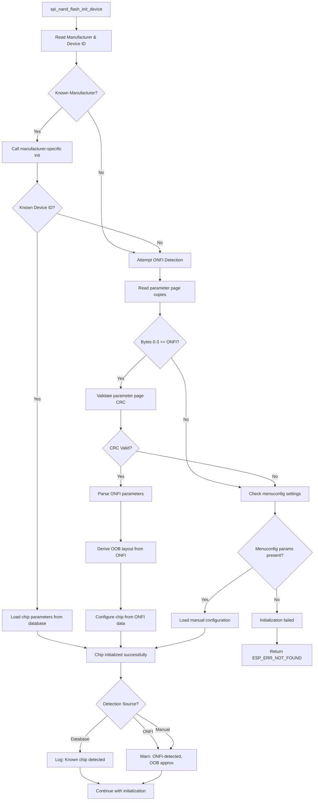

# spi_nand_flash : Anonymous Chip Detection Strategy

> **In-tree mirror** (OpenSpec). Implementation feature spec: [`anonymous_chip_detect_proposal.md`](anonymous_chip_detect_proposal.md).

When a SPI NAND flash chip is not recognized in the driver's device database, the system employs a multi-tiered detection strategy to automatically configure chip parameters and enable operation without hardcoded chip-specific information.

---

## Overview

The detection strategy follows a **hierarchical fallback approach** with three tiers:

1. **Known chip database** (highest confidence)
2. **ONFI parameter page detection** (standard-compliant chips)
3. **Menuconfig manual configuration** (ultimate fallback)

This ensures maximum compatibility while maintaining safe operation even for completely unknown devices.

---

## Detection Hierarchy

### Tier 1: Known Chip Database (Primary)
The driver first attempts to match the chip using manufacturer and device IDs.

**Advantages:**
- Highest confidence and reliability
- Vendor-specific quirks and features handled correctly
- Complete OOB layout information available
- Optimal performance parameters

---

### Tier 2: ONFI Parameter Page Detection (Fallback)

If the chip is not in the known database, attempt ONFI-compliant parameter detection:

#### Detection Process

1. **Parameter page retrieval:**
   - Read the **256-byte ONFI parameter page** using the command sequence required by the device (e.g. `READ_PARAM_PAGE` / typically `0xEC`, OTP / configuration bits, and/or fixed row addresses per datasheet — implementation-defined).
   - Use redundant copies when the device provides them.

2. **ONFI signature check (correctness gate):**
   - Verify bytes **0–3** of the parameter page equal ASCII **`ONFI`** (4 bytes: `0x4F 0x4E 0x46 0x49`).
   - This is the authoritative signature check.

3. **Integrity:**
   - Validate the parameter page using its **CRC** (e.g. over bytes 0–253 vs value in bytes 254–255 per ONFI).

4. **Parameter extraction:**

   Parse standardized ONFI fields:

   **Geometry:**
   - `bytes_per_page`: Page size in data area
   - `spare_bytes_per_page`: OOB size per page
   - `pages_per_block`: Pages in a physical block
   - `blocks_per_lun`: Total blocks per LUN
   - `number_of_luns`: Number of logical units

   **ECC Requirements:**
   - `ecc_bits`: Minimum ECC correctability required (bits per 512 bytes)
   - Used to calculate internal ECC reserved space

   **Timing Parameters:**
   - `t_prog`: Typical page program time (µs)
   - `t_bers`: Typical block erase time (µs)
   - `t_r`: Typical page read time (µs)

   **Reliability:** (Not sure if needed ?)
   - `block_endurance`: Guaranteed program/erase cycles
   - `guaranteed_valid_blocks`: Minimum good blocks at delivery

5. **OOB Layout Derivation:**

   **Minimal Conservative Approach for Safety:**
   
   Since we cannot reliably determine ECC reserved space or vendor-specific OOB regions without complete datasheet information, we expose **only 2 bytes as free OOB**:
   
   - BBM: 2 bytes at offset 0 (reserved, not exposed as free)
   - Free region: 2 bytes at offset 2 (exposed for driver use - page-used marker)
   - Remaining OOB: not exposed

   This minimal approach prevents data corruption from incorrect assumptions about ECC regions or vendor-reserved areas.

   ```c
   // Minimal safe OOB layout for ONFI-detected chips
   static int anon_onfi_oob_free(const void *chip, int section,
                                  spi_nand_oob_region_desc_t *out) {
       if (section > 0) return -ERANGE;  // Only one free region
       
       // Expose only 2 bytes starting at offset 2 (after BBM)
       out->offset = 2;
       out->length = 2;
       out->programmable = true;
       out->ecc_protected = false;  // Assume no ECC protection for safety
       
       return 0;
   }
   
   // BBM configuration (separate from free region)
   spi_nand_oob_layout_t layout = {
       .bbm = {
           .offset = 0,
           .length = 2,
           .good_value = 0xFF,
           .check_pages_mask = SPI_NAND_BBM_CHECK_FIRST_PAGE
       },
       .oob_size = onfi_params.spare_bytes_per_page,
       .ops = &anon_onfi_oob_ops
   };
   ```

**Advantages:**
- Standards-based, works across multiple vendors
- No manual configuration required
- Provides key operational parameters (geometry, timing)
- **Maximum safety** - minimal OOB exposure prevents corruption
- Simple and predictable behavior

**Limitations:**
- **Very limited OOB usage** - only 2 bytes free (sufficient for page-used marker only)
- Cannot store additional driver metadata without vendor documentation
- Most of OOB area remains inaccessible
- Some vendor-specific features unavailable


---

### Tier 3: Menuconfig Manual Configuration (Ultimate Fallback)

If both database lookup and ONFI detection fail, the user can manually configure parameters via menuconfig:

#### Default OOB Layout for Menuconfig Mode

```c
static int anon_manual_oob_free(const void *chip, int section,
                                 spi_nand_oob_region_desc_t *out) {
    if (section > 0) return -ERANGE;
    
    const spi_nand_chip_t *c = chip;
    uint16_t bbm_end = CONFIG_SPI_NAND_ANON_BBM_OFFSET + 
                       CONFIG_SPI_NAND_ANON_BBM_LENGTH;
    uint16_t ecc_bytes = CONFIG_SPI_NAND_ANON_ECC_RESERVED_BYTES;
    
    out->offset = bbm_end;
    out->length = c->oob_layout.oob_size - bbm_end - ecc_bytes;
    out->programmable = true;
    out->ecc_protected = CONFIG_SPI_NAND_ANON_ECC_ENABLED;
    
    return 0;
}
```

**Use Cases:**
- Development and prototyping with new chips
- Emergency operation when ONFI is unavailable
- Custom chip configurations

**Limitations:**
- Requires manual datasheet consultation
- User responsible for correctness
- Highest risk of misconfiguration

---

## Detection Flow Architecture



---

## Usage Recommendations

1. **Production Systems:**
   - Always add new chips to the known database after validation
   - Do not rely on ONFI or manual configuration for production deployments

2. **Development:**
   - ONFI detection is suitable for initial exploration and testing
   - Verify OOB layout with raw OOB read/write before heavy use

3. **Manual Configuration:**
   - Use only when ONFI is unavailable
   - Consult chip datasheet thoroughly
   - Validate with test writes to OOB before deploying

---

## Implementation Notes

### Safety Guardrails

All anonymous chip detection modes shall:

1. **Log detection method clearly:**
   ```c
   ESP_LOGW(TAG, "Chip detected via ONFI parameter page");
   ESP_LOGW(TAG, "OOB layout is approximate - verify before production use");
   ```

2. **Mark chip as anonymous:**
   ```c
   chip->flags |= SPI_NAND_CHIP_FLAG_ANONYMOUS;
   ```

3. **Expose detection method to upper layers:**
   ```c
   esp_err_t spi_nand_get_chip_source(spi_nand_chip_source_t *source);
   // Returns: CHIP_SOURCE_DATABASE / CHIP_SOURCE_ONFI / CHIP_SOURCE_MANUAL
   ```

---

## Limitations of fallback methods

- **OOB layout accuracy:** ONFI and manual modes provide **estimated** layouts only
- **Vendor-specific features:** Anonymous detection cannot enable proprietary features
- **Performance:** Timing parameters may be conservative defaults
- **Reliability:** Block endurance and bad block information may be missing

---