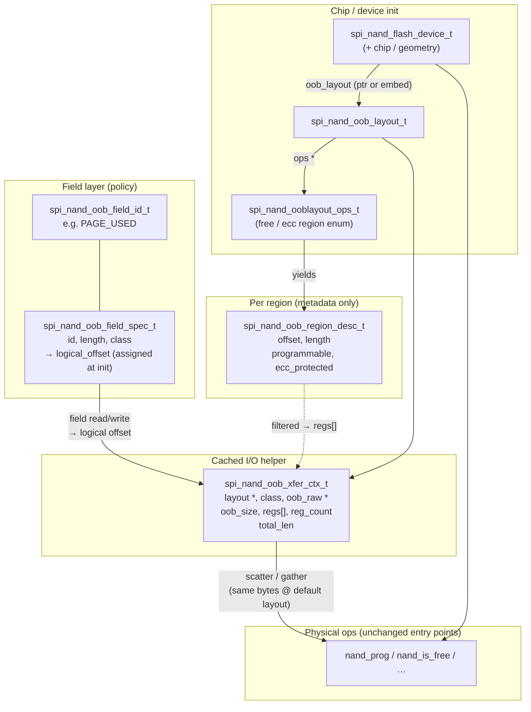

# Proposed change: Configurable OOB layout (`spi_nand_flash`)

**Artifact type:** OpenSpec change proposal (not baseline).  
**Sources of truth for current behavior:** [`baseline.md`](baseline.md), [`feature-module-inventory.md`](feature-module-inventory.md).  
**Design reference:** [`RFC_SPI_NAND_OOB_LAYOUT.md`](RFC_SPI_NAND_OOB_LAYOUT.md) — *Configurable OOB Layout for `spi_nand_flash` Component* (in-tree, sibling under `openspec/`).  
**Implementation plan (ordered PR-sized steps):** [`changes/configurable-oob-layout/README.md`](changes/configurable-oob-layout/README.md).

---

## 1. Current behavior

*(Existing system — what ships today.)*

### 1.1 Where OOB shows up in the baseline model

- The component exposes **logical** pages via Dhara on the legacy path; raw physical page indices are only used under the **Flash BDL** path (baseline §9.2).
- Per-page physical work (read/program, bad-block check/mark, free-page check, ECC status) is implemented in `nand_impl.c` on target and mirrored conceptually on Linux via `nand_impl_linux.c` + mmap emulation (baseline §2–§3; feature-module-inventory §5).
- Linux host tests use an **interleaved** backing file layout: each page slot is `page_size + oob_size` bytes; user-visible capacity is slightly below `flash_file_size` because of OOB overhead (baseline §4.7, §6).
- Public geometry type `nand_flash_geometry_t` describes **page/block/timing/ECC config**; on Linux it additionally carries emulated stride fields (`emulated_page_size`, `emulated_page_oob`). There is **no** baseline-documented, portable “OOB layout descriptor” API today (baseline §4.7; `include/nand_device_types.h`).

### 1.2 Fixed in-driver OOB marker semantics (hardware + emulator)

On the **target** path, `nand_impl.c` uses a **hardcoded 4-byte layout** at column offset **`page_size`** (start of OOB in column address space for SPI NAND program/read):

| Bytes | Role | “Good / expected” pattern (as coded today) |
|--------|------|-----------------------------------------------|
| 0–1 | Bad-block marker (BBM) | `0xFF, 0xFF` ⇒ block considered **good** in `nand_is_bad` |
| 2–3 | Page-used marker | `0xFF, 0xFF` ⇒ page considered **free** in `nand_is_free` |

Concrete behaviors tied to this layout:

- **`nand_is_bad`:** Reads the **first page of the block**, then reads **4 bytes** at `column = page_size` (the plane bit is folded into the column address by `get_column_address(handle, block, page_size)` based on **block index**, not per-page). BBM is **non-0xFFFF** ⇒ bad (`src/nand_impl.c`).
- **`nand_mark_bad`:** Erases block, then programs **`{0x00,0x00,0xFF,0xFF}`** at the same OOB column base on the first block page.
- **`nand_prog`:** After loading main data, programs **`{0xFF,0xFF,0x00,0x00}`** at `column_addr + page_size`.
- **`nand_is_free`:** Reads **4 bytes** at OOB base for the given page; **free** iff bytes 2–3 are `0xFF,0xFF`.
- **`nand_copy`:** When src/dst planes differ, reprograms markers **`{0xFF,0xFF,0x00,0x00}`** on dst. **Proposed:** cross-plane copy must preserve the **full programmed page image** per the active layout (same bytes on flash as a same-plane copy), not only BBM / page-used markers — see §2.2 (*Cross-plane `nand_copy` vs same-plane equivalence*).

The **Linux mmap path** documents and uses the **same byte patterns** at page data offset `page_size` (`src/nand_impl_linux.c` — aligns with CHANGELOG notes on OOB markers).

### 1.3 What is *not* provided today (baseline-aligned)

- No **public** API to configure per-chip OOB region maps, BBM page indices (first vs last page), or interleaved spare layouts.
- No **layout enumeration** or **scatter/gather** abstraction in-tree (RFC proposes these).
- Baseline **§10** deliberately excludes various futures but does **not** enumerate “configurable OOB”; treating this feature as new work is consistent with baseline scope.

---

## 2. Desired new behavior

*(Proposed — aligns with RFC; subject to OpenSpec task breakdown.)*

- **Backward-compatible default:** Layout remains **configurable**, but the **default** for existing chips matches **today’s on-flash layout** (same column base `page_size`, same BBM bytes 0–1 and page-used bytes 2–3). Enabling the feature must **not** change observable behavior until an explicit per-chip layout differs from that default.
- **Page-free marker:** It stays at the **same physical offset** as today for the default layout; code accesses it through a **named field** (field ID / logical slot) rather than open-coded byte indices in scattered call sites. Additional chips or ECC modes may map that field to different physical regions via layout ops without implying a format change for already-supported parts.
- Introduce a **per-chip OOB layout description** (hardware-facing): regions with offset, length, **programmable** vs reserved, **ECC-protected** vs not — via layout callbacks similar to `spi_nand_ooblayout_ops_t` / `spi_nand_oob_region_desc_t` in the RFC.
- **ECC configuration and usable spare:** On many parts, **internal ECC enabled vs disabled** (or a different ECC strength, where the datasheet defines it) changes **user-visible spare length** (`oob_size`), which bytes are **parity / reserved**, and which column ranges are **legal to program**. The active **`spi_nand_oob_layout_t`** (and Linux mmap stride / xfer `oob_size`) must stay **consistent with the chip’s actual ECC configuration**, typically by reading **feature / configuration registers** during device init and selecting a **per-(chip, ECC-mode)** layout (or a vendor hook that derives region list and `oob_size` from those bits). **`oob_size` comes from that predefined layout row**, not from guessing by `page_size` alone (see **§2.1a**). **Toggling ECC after user data exists** generally invalidates on-flash layout assumptions; the default expectation is **ECC mode fixed for the lifetime of the formatted volume** unless a later change explicitly defines migration or reformat rules.
- Centralize **BBM policy** in a layout descriptor: BBM offset/length, good value, and **which pages** to consult (e.g. first page, last page, bitmask). Defaults reproduce today’s **first-page** BBM read/mark behavior for existing tables.
- Split **user-writable free OOB** into logical streams (**ECC-protected** vs **not**), then assign **named fields** (e.g. page-used marker) to **logical offsets** inside those streams — upper layers use **field IDs** at the glue boundary; physical mapping is resolved below (`nand_impl` + layout).
- Provide **transfer context + scatter/gather** (or equivalent) so read/modify/program paths compose **one physical program** while respecting fragmentation/interleaving (RFC `spi_nand_oob_xfer_ctx_t`, scatter/gather APIs).
- Optionally expose **debug-oriented raw OOB** read/write behind clearly non-stable or restricted semantics (RFC raw OOB section).
- Default philosophy per RFC: treat spare area as usable except where explicitly **reserved** — enabling conservative bring-up when datasheet detail is incomplete.

### 2.1 Kconfig rollout (experimental → default-on)

- The feature is **experimental** at first: **enabled or disabled via Kconfig**, with default **`n`** until the implementation, tests, and hardware coverage are considered stable.
- When stable, flip the Kconfig default to **`y`** (and update help text / docs so “experimental” is removed or reduced to a compatibility note, as appropriate).
- With **`n`**, the component keeps **today’s compiled behavior** (fixed offsets in `nand_impl.c` / Linux twin path, no new layout tables required) so tree and CI stay predictable during bring-up.
- Exact symbol name and menu placement follow existing `spi_nand_flash` Kconfig style (TBD in implementation; e.g. under component options).

### 2.1a Init-time layout selection (implementation checklist)

These notes are for whoever implements configurable OOB so init behavior is unambiguous and matches datasheet-backed tables rather than implicit heuristics.

1. **Probe identity first** — Manufacturer / device ID (and any ID length quirks) as today, before choosing layout.
2. **Apply vendor ECC configuration before reading ECC mode for layout** — Run the same chip/vendor **init** path that **enables or selects internal ECC** (and related configuration) so the part is in the mode used for subsequent read/program. **Then** read feature/configuration registers for the **ECC mode key** used in the layout table. If ECC is probed **before** vendor init configures the chip, register bits can disagree with real I/O behavior.
3. **Read ECC configuration during init** — Use the part’s **feature / configuration / protection** registers (datasheet-specific) to determine **active internal ECC** (on/off or strength, whichever the table keys on). Treat that as an **ECC mode key** (`enum` or bitmask) used only for layout lookup, not recomputed on every I/O.
4. **Select a predefined layout row** — Match `(MI, DI, ECC mode key)` to a **static** entry in `src/devices/nand_*.c` / device DB; if no row matches, use the **generic** default layout (§1.2 / backward-compatible default). **No** separate application-level layout override in `spi_nand_flash_config_t` for this work — table → generic only. **Do not** derive `oob_size` from `page_size` alone (e.g. avoid hardcoded “512⇒16, 2048⇒64, 4096⇒128” as the *only* source of truth); ECC on/off can change user-visible spare for the same page size. The **authoritative user-visible spare length** for buffers, mmap stride, and cross-plane copy bounds comes from the **selected layout** (RFC `spi_nand_oob_layout_t` / equivalent **`oob_size` or `oob_bytes`** field and region list), copied onto the handle at init.
5. **What `page_size` is still for** — Main area length, block/page geometry, and the **column offset of the start of spare** in the driver’s model (today: OOB markers at column `page_size`). It does **not** replace an explicit **`oob_size`** from the layout when spare length must be exact.
6. **Cache on the handle** — After init: active layout pointer, **`oob_size`** (and any precomputed region metadata / xfer caps the RFC describes). Steady-state `nand_*` paths use **cached** values; no per-page re-derivation from page size.
7. **Unknown or inconsistent ECC** — If register values do not match any supported table row, **fail initialization** with a clear error (aligns with “ignore unknown chips” / no silent guessing until product policy extends). Do not pick a random `oob_size` to continue.
8. **Linux mmap emulator** — Set `emulated_page_oob` (or successor) from the **same** `oob_size` as the target path for the active layout so host tests and on-device behavior stay aligned (see §4 `nand_impl_linux.c` row).

**Concurrency (simple):** Some callers use `nand_*` **without** holding `handle->mutex` (raw Flash BDL). A **mutable** OOB scratch area on the handle would let two concurrent callers **trample** each other. Keep **per-call** scratch for xfer helpers (**stack-local** `spi_nand_oob_xfer_ctx_t` + DMA `read_buffer`/`temp_buffer` where required) instead of a shared mutable OOB buffer on the handle (proposal §2.2; `changes/configurable-oob-layout/README.md`).

### 2.2 Dhara scope and hot-path / performance expectations

- **Dhara → OOB call surface (current):** The Dhara library itself stores **no metadata** in OOB, but its `dhara_nand_*` callbacks in `src/dhara_glue.c` drive **five** `nand_impl` primitives that touch OOB:

  | Dhara callback | `nand_impl` entry | OOB bytes touched |
  |---|---|---|
  | `dhara_nand_is_bad` | `nand_is_bad` | reads BBM (offset 0, length 2) on first page of block |
  | `dhara_nand_mark_bad` | `nand_mark_bad` | writes BBM `{0x00,0x00}` + page-used `{0xFF,0xFF}` (4 bytes) |
  | `dhara_nand_is_free` | `nand_is_free` | reads page-used (offset 2, length 2) |
  | `dhara_nand_prog` | `nand_prog` | writes BBM `{0xFF,0xFF}` + page-used `{0x00,0x00}` (4 bytes), implicit |
  | `dhara_nand_copy` | `nand_copy` | cross-plane: full programmed page image per layout (see cross-plane equivalence below); same-plane: full spare via chip cache |

  All five must therefore go through the layout path when Kconfig is `y`. Layout work must **not** introduce additional OOB transactions on paths Dhara does **not** call (e.g. there is no Dhara-driven "scan all spare" today — preserve that).
- **Hot path:** When Kconfig is **off**, zero added cost. When **on**, avoid extra NAND transactions, heap allocations, or full spare scans on every logical read/write beyond what the existing marker program/read already implies; prefer **init-time** layout enumeration / **cached** *region metadata* for steady-state I/O. Per-call xfer ctx state (the `oob_raw` buffer and in-flight bytes) lives **on the stack** for the call, not on the device handle, so the layout machinery is lock-free against the unsynchronized raw Flash BDL paths (baseline §9.1).
- **Single program-execute per logical page program (invariant):** `nand_prog` issues `program_load(data) → program_load(markers) → program_execute_and_wait`. Data and OOB markers are committed in **one** atomic page program. The layout-driven scatter machinery **must** preserve this: all `program_load` calls for a layout's regions on a single logical page program must precede **exactly one** `program_execute`. Any future layout that would require two `program_execute`s on the same page is a new partial-program failure mode and is out of scope for this proposal.
- **Chip-internal page-copy preserves OOB byte-for-byte (invariant):** `nand_copy` has two branches (`src/nand_impl.c`): when `src_column_addr != dst_column_addr` (cross-plane) **today's** code does a CPU read → program-load main + four marker bytes → program-execute; **with configurable layout**, cross-plane must program the **full page image** the layout defines (see *Cross-plane `nand_copy` vs same-plane equivalence* below). When equal (same-plane) it relies on the chip's **internal page-move command** (program-execute on dst after a page read into the chip cache) which carries the **entire** spare area along with the data. This is treated as a **load-bearing invariant** for all supported parts: configurable layouts ride along the same-plane fast path with **no** extra OOB programming. If a future part is added where the chip-internal page-move does **not** preserve OOB byte-for-byte under that part's ECC mode, that part's vendor module must opt out of the fast path explicitly (out of scope for this proposal).
- **Cross-plane `nand_copy` vs same-plane equivalence:** Cross-plane copy must preserve the **full page image** the active layout defines for program, which includes **all driver-relevant spare content**, not only the BBM / page-used fields. Whether the implementation achieves that by iterating **all fields** or by a single **main+OOB gather** is an **implementation detail**, as long as the **bytes on flash** for `dst` after a successful cross-plane copy match what a same-plane copy would have produced for the same `src` (subject to datasheet constraints on internal ECC and which spare columns may be programmed).
- **Future Dhara changes:** If Dhara is ever extended to use additional OOB fields, the layout layer should keep **resolve/mapping cost minimal** (cached region lists, constant-time field → physical mapping after init). Any future Dhara-side change should be reviewed for **bounded overhead** on the page program / free-check paths.

### 2.3 Minimal type diagram

Types follow the RFC shape (names may adjust during implementation). The diagram is **logical**: increment delivery may introduce subsets of these types before all edges exist in code.

- **Data flow (read/program path):** layout `OPS` enumerates `REG` → init builds `CTX.regs[]` per class → a **field** resolves through its assigned **logical offset** → **gather** (read) or **scatter** (program) maps between logical slice and bytes in `oob_raw[]` / the NAND cache buffer.
- **Default layout:** typically one contiguous programmable region at column base `page_size` covering BBM + page-used bytes (see §1.2); scatter/gather reduces to the **same copies** as today’s fixed-offset code — no extra NAND transactions.
- **Layer boundary:** **Dhara is unchanged** and does not use field IDs. **`nand_*`** uses **init-cached offsets** + scatter/gather on DMA buffers at runtime. **Field ID** enums / `field_spec_t` exist for **init-time** tables and readability only (optional indirection with **no** required per-I/O enum dispatch) — see [`changes/configurable-oob-layout/README.md`](changes/configurable-oob-layout/README.md). `spi_nand_ooblayout_ops_t` and `spi_nand_oob_region_desc_t` remain **chip-facing** and **private** until explicitly promoted (§7 Q4).

**Explicit non-goals for this proposal section (unless later specs add them):** Forking or modifying **Dhara** for this feature — only **`dhara_glue.c` (and physical layer)** adapt to field/layout plumbing while Dhara’s API and on-disk map behavior stay as today; changing Dhara’s logical sector contract from upstream; adding filesystem code into this component; or promising stronger-than-Dhara durability (baseline §9.4, §10).

---

## 3. Assumptions

| ID | Assumption | Notes |
|----|------------|--------|
| A1 | Internal ECC engines still apply per vendor rules; software only chooses **where** it may legally write user/OOB metadata. | Must stay consistent with vendor modules’ ECC enable/path (baseline §7.2–§7.3). |
| A2 | **Dhara itself is not updated** for this change. **`src/dhara_glue.c`** may change only for **non-behavioral** fixes explicitly listed in the step plan (e.g. [`step 05`](changes/configurable-oob-layout/step-05-device-state-and-init-hook.md): `MALLOC_CAP_INTERNAL` for the Dhara private struct per [`known-bugs.md`](known-bugs.md) §11.4.2). It **still** calls the same `nand_*` entry points (`nand_is_bad`, `nand_mark_bad`, `nand_is_free`, `nand_prog`, `nand_copy`). The layout work happens **inside** those primitives in `nand_impl.c` / `nand_impl_linux.c`, so glue continues to drive the same physical marker semantics when the **default layout** is selected. | Confirmed as **proposal constraint** (see §2.2 Dhara→OOB call surface). |
| A3 | OOB layout is **configurable**, but **current behavior is preserved** by default: same physical offsets for BBM (bytes 0–1) and page-used marker (bytes 2–3) as §1.2, so deployed media and existing vendor tables do not require a breaking migration for supported chips. Alternate layouts apply only where explicitly configured (e.g. new parts / datasheet-driven tables). | Intentionally avoids an opt-in “breaking change” story for the existing fleet when defaults are used. |
| A4 | Sibling `spi_nand_flash_fatfs` is **out of scope** for this proposal. It consumes only the logical page API (legacy path) and never reads raw OOB; the default-preserves-bytes invariant (A3) means it cannot observe the change. No audit of that repo is required for this work. | Scope decision. |
| A5 | RFC naming (`-ERANGE`, Linux MTD-style ops) may need mapping to **ESP-IDF conventions** (`esp_err_t`, logging). | Design detail. |
| A6 | **Kconfig** gates the feature: default **`n`** while experimental; default **`y`** once stable (same mechanism as other component options — see baseline §6 patterns). | Rollout policy for this proposal. |
| A7 | Dhara’s OOB call surface today is **the five primitives in §2.2** (BBM read/write, page-used read, marker maintenance on prog/copy). Layout work must cover those five and must **not** inflate hot paths with layout work Dhara does not need (e.g. no full-spare scans, no per-call heap allocations, no extra `program_execute` per logical page program — see §2.2 invariants). | Verified against `src/dhara_glue.c` and `src/nand_impl.c`. |
| A8 | If Dhara gains more OOB consumers later, layout resolution should stay **low overhead** (prefer cache + O(1)-style mapping after init; avoid per-I/O layout walks). | Forward-looking constraint; not a commitment to change Dhara now. |
| A9 | **Active ECC state** (from feature/configuration registers at init, or a fixed policy if the part does not expose ECC toggles) determines **which layout variant and `oob_size`** apply for spare I/O and emulator stride; that state is treated as **stable after init** unless the component explicitly supports runtime ECC changes with documented erase/migration requirements. | Links §2 (*ECC configuration and usable spare*), **§2.1a** (init checklist), device DB “/ ECC mode” (§4), and V4. |

---

## 4. Impacted modules / interfaces

| Area | Impact | Confidence |
|------|--------|------------|
| `src/nand_impl.c` | Implement layout-driven BBM / field placement; **default layout** must reproduce today’s fixed `page_size` + 4-byte marker behavior byte-for-byte on program/read paths. | **High** |
| `src/nand_impl_linux.c`, `src/nand_linux_mmap_emul.c` | Emulator file layout: stride is `page_size + chip.emulated_page_oob` per page (today). With configurable OOB the formula stays the same; `chip.emulated_page_oob` is driven by the active layout's `oob_bytes` (default layout reproduces today's `16 / 64 / 128` for `512 / 2048 / 4096` page sizes — baseline §4.7), so no on-disk stride change for default. Marker semantics in the Linux primitives must mirror the target path step-for-step (see step 10). | **High** |
| `src/devices/nand_*.c`, `priv_include/nand_flash_devices.h` | Supply `spi_nand_oob_layout_t` (or successor) per JEDEC ID / ECC mode. | **High** |
| `priv_include/nand_impl.h`, internal chip struct | Hold layout pointer / cached xfer contexts. | **High** |
| `include/nand_device_types.h` (and/or new public header) | New types if any layout surface is **stable public API**; otherwise keep in `priv_include/` (baseline §4.0). | **Medium** — API boundary TBD |
| `src/dhara_glue.c` | **Adapts** to field-based OOB access (and any small helpers) while **Dhara library code stays unchanged**; still calls the same `nand_*` entry points with equivalent physical effects under default layout. | **High** (per proposal direction) |
| `include/nand_private/nand_impl_wrap.h`, `src/nand_impl_wrap.c` | Wrappers may need to expose new primitives if diagnostics/tests need them. | **Low–Medium** |
| `src/nand_flash_blockdev.c` | IOCTLs touching free page / bad block / copy page **indirectly** depend on marker correctness. | **Medium** |
| `src/nand_diag_api.c` | Any scan interpreting page state could depend on marker positions. | **Unknown** |
| Host tests (`host_test/`) and on-target app (`test_app/`) | Fixtures assume fixed OOB size + marker layout; add **`sdkconfig.ci.oob_layout`** (or equivalent) in **both** apps, pytest matrix, and preserve default runs with Kconfig off (baseline §8.1 / §8.2). | **High** |
| `Kconfig` / `CMakeLists.txt` | New option (experimental default `n`, later default `y`); optional compile of layout helpers or `#if` branches in `nand_impl` / glue. | **High** |

---

## 5. Risks

| Risk | Description |
|------|-------------|
| **Medium corruption / bricking** | Wrong BBM or page-used placement → bad-block detection or GC/free detection diverges from reality. |
| **On-flash incompatibility** | Mitigated for **default layout** (same offsets as §1.2). Risk remains for **non-default** layouts: wrong tables or enabling alternate mapping on existing fleet could still corrupt metadata — treat explicit layout selection like a compatibility boundary. |
| **ECC / partial programming** | Writing metadata in regions covered (or not covered) by internal ECC incorrectly → silent data loss or uncorrectable reads. |
| **Performance / stack** | Scatter/gather and extra buffering on hot paths (`nand_prog`, `nand_copy`) — watch DMA buffers and heap (baseline §6). Mitigate by **Kconfig-off** fast path, **init-time** caching, and **no** broad OOB scanning on steady-state Dhara I/O (§2.2). |
| **Dual code paths** | While experimental, **`n`** vs **`y`** doubles behavioral surface — CI should cover both until default is universally **`y`**. |
| **Plane addressing** | `get_column_address` already adjusts for planes; layout must compose cleanly with plane bits (**implementation risk**). |
| **API stability** | Promoting experimental RFC APIs to `include/` triggers breaking-change discipline (baseline §4.0). |
| **Verification gap** | Baseline notes limited automated CI coverage per vendor/part (baseline §11.2); OOB layout multiplies hardware validation burden. |

---

## 6. Required validation

| # | Validation | Rationale |
|---|------------|-----------|
| V1 | Per **vendor family** (or representative parts): bad-block mark/read, program, free-page detection, copy-page, wear-leveling smoke. Cover **both** legacy init path and BDL path (since BDL routes IS_BAD_BLOCK / IS_FREE_PAGE / COPY_PAGE through the same `nand_*` primitives — see V3). | Consumer matrix per baseline §4.0 (legacy + BDL); sibling FatFs is out of scope for this proposal (§3 A4). |
| V2 | **Linux host tests** updated: mmap stride, marker placement, Dhara FTL tests (`test_nand_flash_ftl.cpp` assumptions). | Baseline §8.2 |
| V3 | **BDL** IOCTL paths that depend on physical correctness (`IS_FREE_PAGE`, `IS_BAD_BLOCK`, `COPY_PAGE`, ECC-related IOCTLs). | Baseline §3.4, §4.2 |
| V4 | **Regression**: chips with **internal ECC** vs datasheets — confirm programmable spare regions, **`oob_size`**, and mmap stride match layout tables **for each ECC configuration the driver supports** (e.g. ECC on vs off when both are in scope). | ECC changes spare geometry (§2, A9); RFC motivation |
| V5 | If public raw-OOB debug API is added: enforce **non-ISR**, document concurrency vs `handle->mutex` / Flash BDL unsynchronized raw path (baseline §9.1). |
| V6 | Watchdog-sensitive paths: full-device scans already risky (baseline §9.3); avoid adding full-device OOB walks on hot paths. |
| V7 | **Power-loss spot checks** (best-effort): behavior remains bounded by Dhara guarantees (baseline §9.4); no new durability claims without explicit design. |
| V8 | **Kconfig matrix:** build and run representative tests with configurable OOB **`n`** (legacy path) and **`y`** (new path); confirm no regression in throughput/latency budgets on reference hardware when **`y`** beyond existing marker cost. | Experimental rollout + performance expectation §2.2 |
| V9 | **`test_app/` on-target (mandatory):** add **`sdkconfig.ci.oob_layout`** (legacy + OOB **`y`**) and **`sdkconfig.ci.bdl_oob_layout`** (BDL + OOB **`y`**). The **full** `pytest_spi_nand_flash.py` suite must **pass on hardware** for **both** presets — same coverage as today’s legacy and BDL CI jobs, not build-only. Complement with **`host_test/`** full run (baseline §8.1 / §8.2). If CI lacks hardware, enforce documented manual full pytest before merge. | Implementation step 11 |

---

## 7. Decisions and open questions

### 7.0 Resolved decisions (locked for this proposal)

Mirrors the structure of `baseline.md` §11.3. These decisions are **not** open questions; they are constraints that step-level work must respect.

- **Default-preserves-bytes:** Default layout produces the **byte-identical** on-flash bytes/offsets as §1.2 for every chip supported before this work. Enabling the Kconfig with the default layout is observable as a no-op on flash and on the wire. (Was Q1.)
- **Dhara is not modified:** Only `src/dhara_glue.c` reads/writes through unchanged Dhara callbacks; the layout work happens **inside** `nand_impl.c` / `nand_impl_linux.c`. Dhara→OOB call surface is the **five primitives** enumerated in §2.2. (Was Q7.)
- **Single program-execute per logical page program:** All `program_load` calls for a layout's regions on one logical page program **must** precede exactly one `program_execute_and_wait` (see §2.2 invariant).
- **Chip-internal page-copy preserves OOB byte-for-byte:** The `nand_copy` same-plane fast path relies on the chip's internal page-move command carrying the entire spare area along with the data. Configurable layouts inherit this for free, so no extra OOB programming is required on the same-plane branch (see §2.2 invariant). Any future part that violates this assumption must opt out of the fast path in its vendor module — out of scope here. (Was Q5.)
- **No migration for default layout:** Already-shipped products on default layout require **no** migration. Migration applies only if a product explicitly opts into a different physical layout for a part. (Was Q6.)
- **Sibling `spi_nand_flash_fatfs` is out of scope:** This proposal updates only the `spi_nand_flash` driver. The default-preserves-bytes invariant means the sibling cannot observe the change (see §3 A4).

### 7.1 Open questions

| # | Question |
|---|------------|
| Q2 | What is the **minimum viable** increment: BBM configurability only first, or full scatter/gather + fields in one change? (Step plan currently chooses scatter/gather + fields together — see step 04.) |
| Q3 | **`MAX_REG` / `SPI_NAND_OOB_MAX_REGIONS` for v1:** locked to **8** (see [`changes/configurable-oob-layout/README.md`](changes/configurable-oob-layout/README.md) *Implementation decisions*). Revisit only if a datasheet-backed layout needs more than eight disjoint free fragments. |
| Q4 | Are **RFC public APIs** (`spi_nand_oob_field_read/write`, raw OOB) intended to be **stable** under `include/` or **internal/debug-only** for the first release? **Decision:** stays **private** under `priv_include/` for this release; promotion is a separate change (see baseline §4.0 stability contract). |
| Q8 | **Known bugs vs this epic:** [**§11.4.2**](known-bugs.md) (device handle + Dhara private struct to internal RAM) — [`step 05`](changes/configurable-oob-layout/step-05-device-state-and-init-hook.md). [**§11.4.1**](known-bugs.md) (`nand_emul_get_stats`) — [`step 10`](changes/configurable-oob-layout/step-10-linux-parity.md). After merge, sync `known-bugs.md` / baseline §11.4. Layout metadata stays inside the handle object (no separate heap blob for layout-only state). |

---

## Summary

**Today**, OOB usage for BBM and page-used state is **fixed** at bytes **0–3** past **`page_size`** in column space, with BBM checked on the **block’s first page**, across target and mmap emulation. Dhara’s glue drives **five** OOB-touching primitives (`nand_is_bad`, `nand_mark_bad`, `nand_is_free`, `nand_prog`, `nand_copy`); Dhara itself stores no metadata in OOB. **Proposed**, add **Kconfig-gated experimental** support (default **`n`**, later **`y`** when stable) for RFC-style **layout ops**, **named fields** (page-used same offset under defaults), and **scatter/gather** where spare is non-contiguous — **without changing Dhara**, **without breaking current behavior** when default layout is used, **preserving the single-`program_execute`-per-page** invariant, and **relying on chip-internal page-copy to carry OOB on the same-plane fast path** (§7.0). Per-call xfer state is **stack-local** so the new code stays lock-free with respect to the unsynchronized raw Flash BDL paths (baseline §9.1). **Highest-risk** areas remain **`nand_impl.c`**, **emulator parity**, validation of **non-default** layouts, **dual Kconfig** CI coverage, and **API stability** under baseline §4.0.
