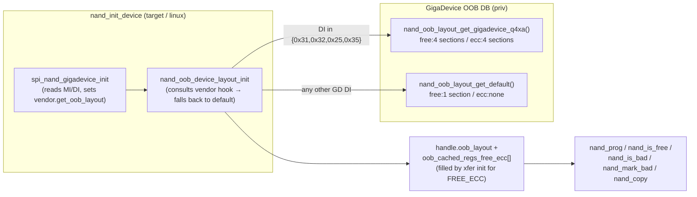

# Proposed change: GigaDevice GD5F1GQ4xA-family OOB layout (`spi_nand_flash`)

**Artifact type:** OpenSpec change proposal (not baseline).
**Sources of truth for current behavior:** [`baseline.md`](baseline.md), [`feature-module-inventory.md`](feature-module-inventory.md).
**Parent proposal (framework this depends on):** [`configurable_oob_layout_proposal.md`](configurable_oob_layout_proposal.md) — defines `spi_nand_oob_layout_t`, `spi_nand_ooblayout_ops_t`, BBM descriptor, FREE_ECC class, scatter/gather, default-preserves-bytes invariant. Implementation steps **01–12** under [`changes/configurable-oob-layout/`](changes/configurable-oob-layout/) must be merged before any step in this proposal.
**Design reference:** [`RFC_SPI_NAND_OOB_LAYOUT.md`](RFC_SPI_NAND_OOB_LAYOUT.md).
**Datasheet reference (canonical):** Linux MTD `drivers/mtd/nand/spi/gigadevice.c` — `gd5fxgq4xa_ooblayout` ops (free / ecc, 4 sections each, 64-byte spare).
**Implementation plan (ordered PR-sized steps):** [`changes/gigadevice-oob-layout/README.md`](changes/gigadevice-oob-layout/README.md).

---

## 0. Scope

This proposal is **scoped narrowly**: add **one** datasheet-backed device-specific OOB layout — the GigaDevice **GD5F1GQ4xA / GD5F2GQ4xA / GD5F4GQ4xA** family (single-plane, 2 KiB page, 64-byte spare, internal ECC always on, 4-section interleaved spare layout) — and the per-vendor selection hook needed to choose it at init time. It is the **first proof-point** for the framework landed by [`configurable_oob_layout_proposal.md`](configurable_oob_layout_proposal.md):

- It exercises **multiple free regions** through `free_region(...)` (scatter/gather across non-contiguous user OOB).
- It exercises the **`ecc_region` callback** (parity bytes that must never be programmed by the driver).
- It is a **64-byte-spare** layout, so it fits inside today's `nand_oob_device.c` `page_size → spare_size` mapping (16/64/128) — **no Linux mmap stride change** is required for this proposal.
- It is **byte-for-byte compatible** with already-formatted media for the targeted GD parts under the default layout (BBM at bytes 0–1, PAGE_USED at bytes 2–3 — see §2.4).

**Other GigaDevice variants** (GD5F1GQ4UExxG / GD5F1GM7UExxG / GD5F2GM7UExxG / GD5F4GM8UExxG / GQ5 family — 128-byte spare, single free + single ECC region per Linux `gd5fxgqx_variant2_ooblayout`) are **explicitly out of scope** here. They would require:

- A per-chip `oob_bytes` override (128 instead of the 64 returned today by `nand_oob_device.c` for 2 KiB pages).
- A matching change to the Linux mmap emulator stride for those parts.
- A second layout entry and DI-mapping rules.

Adding a 128-byte-spare layout is a **separate follow-up** (see §7.1 Q3).

Other vendors (Winbond / Micron / Alliance / XTX / Zetta) and other ECC modes are likewise out of scope.

---

## 1. Current behavior

*(Existing system once the configurable-oob-layout framework is merged.)*

### 1.1 GigaDevice parts under the default layout

Per [`configurable_oob_layout_proposal.md`](configurable_oob_layout_proposal.md) §1.2 and §2.1a, when the experimental Kconfig is **`y`** but no per-chip layout is selected, **all** GigaDevice parts fall back to the **generic default layout** ([`changes/configurable-oob-layout/step-03-default-layout-table.md`](changes/configurable-oob-layout/step-03-default-layout-table.md)):

| Slot | Offset | Length | Programmable | ECC-protected | Class |
|------|--------|--------|--------------|---------------|-------|
| BBM | 0 | 2 | (BBM, not free) | yes | n/a |
| free section 0 | 2 | 2 | yes | yes | FREE_ECC |

Total user-free bytes exposed: **2** (PAGE_USED only).

### 1.2 What the chips actually have

Per Linux MTD `gd5fxgq4xa_ooblayout` (the canonical software reference for the GD5F1GQ4xA / GD5F2GQ4xA / GD5F4GQ4xA family), the 64-byte spare is divided into **four 16-byte sections** with this on-flash structure:

| Bytes | Role | Programmable | Notes |
|-------|------|--------------|-------|
| 0 | BBM (factory bad-block marker) | by `nand_mark_bad` only | Linux models 1 byte; Espressif keeps 2 (see §2.4 — preserves default-layout writes byte-for-byte) |
| 1 | reserved next to BBM (Espressif default treats as part of BBM) | by `nand_mark_bad` only | Written `0x00` on mark-bad / `0xFF` otherwise |
| 2–7 | free user OOB, ECC-protected | yes | section 0 free bytes (after BBM/BBM-extension) |
| 8–15 | ECC parity (sector 0) | **no** | internal ECC engine only |
| 16–23 | free user OOB, ECC-protected | yes | section 1 free bytes |
| 24–31 | ECC parity (sector 1) | **no** | internal ECC engine only |
| 32–39 | free user OOB, ECC-protected | yes | section 2 free bytes |
| 40–47 | ECC parity (sector 2) | **no** | internal ECC engine only |
| 48–55 | free user OOB, ECC-protected | yes | section 3 free bytes |
| 56–63 | ECC parity (sector 3) | **no** | internal ECC engine only |

Under today's behavior the driver writes **only bytes 0–3** (BBM 0–1 + PAGE_USED 2–3) — well inside `section 0`, never touching parity. The remaining **28 free bytes** (bytes 4–7 and 16–23 + 32–39 + 48–55) are **silently unused**.

### 1.3 What is missing today (even with the framework merged)

- No per-chip layout entry for the GD5F1GQ4xA family — the framework can describe it, but the **table is empty**.
- No selection hook between vendor `*_init` and `nand_oob_device_layout_init` — the latter unconditionally returns `nand_oob_layout_get_default()`.
- No way for `dhara_glue.c` / `nand_*.c` to take advantage of the additional 28 free bytes (this proposal does **not** add new fields; it only **exposes** the additional free bytes for future use).

---

## 2. Desired new behavior

### 2.1 The GD5F1GQ4xA-family layout (proposed)

A new layout `nand_oob_layout_get_gigadevice_q4xa()` (private, under `priv_include/`):

```text
oob_bytes        : 0   (use chip mapping → 64 for 2 KiB page; same as default)
bbm.offset       : 0
bbm.length       : 2   (kept at 2 for byte-for-byte compat with default — see §2.4)
bbm.good_pattern : {0xFF, 0xFF}
bbm.check_pages_mask : SPI_NAND_BBM_CHECK_FIRST_PAGE

free_region(section)            ecc_region(section)
  0: {2,  6, prog, ecc_prot}      0: { 8, 8, !prog, ecc_prot}
  1: {16, 8, prog, ecc_prot}      1: {24, 8, !prog, ecc_prot}
  2: {32, 8, prog, ecc_prot}      2: {40, 8, !prog, ecc_prot}
  3: {48, 8, prog, ecc_prot}      3: {56, 8, !prog, ecc_prot}
  >=4: ESP_ERR_NOT_FOUND          >=4: ESP_ERR_NOT_FOUND

Total free user OOB (FREE_ECC class) : 6 + 8 + 8 + 8 = 30 bytes
Total ECC parity (advisory)          : 8 * 4         = 32 bytes
BBM (non-free, non-parity)            : 2 bytes
Sum                                   : 64 bytes ✓
```

This is an **Espressif-adapted port** of Linux MTD's `gd5fxgq4xa_ooblayout`:

- BBM length is **2** (not Linux's 1) so existing `nand_mark_bad` writes (`{0x00, 0x00}`) and `nand_is_bad` reads stay byte-for-byte identical to the default layout (see §2.4).
- Free section 0 starts at offset **2** (not Linux's 1) for the same reason.
- All other section offsets and lengths match Linux exactly.

### 2.2 Selection mechanism (per-vendor hook)

Add an **optional** vendor callback `get_oob_layout(dev) -> const spi_nand_oob_layout_t *` carried on the device handle (or vendor-init-set field). `nand_oob_device_layout_init` consults it before falling back to the default:

```c
const spi_nand_oob_layout_t *layout = NULL;
if (handle->vendor_get_oob_layout) {
    layout = handle->vendor_get_oob_layout(handle);  /* may return NULL */
}
if (layout == NULL) {
    layout = nand_oob_layout_get_default();
}
handle->oob_layout = layout;
```

Vendor `*_init` (`spi_nand_gigadevice_init` in this proposal's case) sets `handle->vendor_get_oob_layout` to its own resolver. The GigaDevice resolver matches the **device ID** (after vendor init has run) against a small static table:

| Espressif `device_id` | Family | Layout |
|------|---------|---------|
| `GIGADEVICE_DI_31` | GD5F1GQ4xA (1 Gb, 2 KiB, 64 B spare, 1024 blk) | `gd5fxgq4xa` |
| `GIGADEVICE_DI_32` | GD5F2GQ4xA (2 Gb, 2 KiB, 64 B spare, 2048 blk) | `gd5fxgq4xa` |
| `GIGADEVICE_DI_25` | GD5F4GQ4xA (4 Gb, 2 KiB, 64 B spare, 4096 blk) | `gd5fxgq4xa` |
| `GIGADEVICE_DI_35` | GD5F4GQ4xA alias (4 Gb, 4096 blk) | `gd5fxgq4xa` |
| any other GD DI | — | NULL → default layout |

> **Datasheet verification gate (mandatory before merging step 02):** the four Espressif single-byte DIs above are derived from `nand_gigadevice.c`'s switch on `device_id`. The Linux MTD reference keys this layout off opcode-based IDs `0xf1 / 0xf2 / 0xf4`. Each Espressif DI in the table above must be confirmed against the **chip's datasheet** as a 64-byte-spare Q4xA-family part **before** the implementation is merged. Any DI that turns out to be a 128-byte-spare variant2 part **must be removed** from this table and deferred to a later proposal (§7.1 Q3).

The hook is the **only** allowed selection mechanism for this proposal — there is **no** `spi_nand_flash_config_t` runtime override (mirrors the parent proposal's "table → generic only" decision, [`changes/configurable-oob-layout/README.md`](changes/configurable-oob-layout/README.md) Implementation decisions).

### 2.3 ECC mode

Internal ECC is **always enabled** on Q4xA-family parts (datasheet: ECC bypass is not user-toggleable in normal operation). Therefore:

- Layout selection in this proposal is **not** keyed on an ECC-mode register read — `(MI, DI)` is sufficient.
- The ECC-mode-key plumbing required by the parent proposal §2.1a remains a **future** concern for parts where datasheet exposes ECC enable/disable as a runtime knob (out of scope here).

### 2.4 Default-preserves-bytes (compatibility invariant)

The parent proposal §7.0 locks the rule: **switching a chip to a non-default layout must not require a migration if the bytes the driver actually writes/reads under the default layout match those under the new layout.** This proposal honors that:

| Operation | Default writes/reads | Q4xA layout writes/reads | Equivalent? |
|---|---|---|---|
| `nand_mark_bad` programs first page | bytes 0–1 = `{0x00, 0x00}` (BBM 2 bytes), bytes 2–3 = `{0xFF, 0xFF}` (page-used "free") | same bytes 0–1 (BBM length 2 in this layout), same bytes 2–3 (PAGE_USED at logical offset 0 of FREE_ECC = byte 2) | **yes** |
| `nand_is_bad` reads first page | bytes 0–1, BBM if non-`{0xFF,0xFF}` | bytes 0–1, BBM if non-`{0xFF,0xFF}` | **yes** |
| `nand_prog` writes markers | bytes 0–1 = `{0xFF,0xFF}`, bytes 2–3 = `{0x00,0x00}` (page-used "used") | same | **yes** |
| `nand_is_free` reads page-used | bytes 2–3 | bytes 2–3 | **yes** |
| Bytes 4–7 | not written | not written (free, but no field assigned) | identical on flash |
| Bytes 16–55 (free sections 1–3) | not written | not written (free, but no field assigned) | identical on flash |
| Bytes 8–15, 24–31, 40–47, 56–63 (ECC parity) | not written | **must not be written** (enforced by `programmable=false`) | identical on flash |

A device formatted on the default layout and later upgraded to a build that selects this Q4xA layout sees **no on-flash byte change**. PAGE_USED stays at byte 2; BBM stays at bytes 0–1. The new layout merely **describes** more of the spare, it does not move existing fields.

If a future field is added that lands beyond byte 3, that field is a new on-flash artifact and is subject to the parent proposal's own compatibility rules at the point it is introduced (out of scope here).

### 2.5 What this proposal does **not** change

- No new public API in `include/`. The new layout pointer accessor stays under `priv_include/` (parent proposal §7 Q4).
- No change to Dhara, `dhara_glue.c`, or the five `nand_*` primitives — they continue to call `field_read/write(PAGE_USED)` / BBM helpers added by the parent proposal; only the **layout they resolve through** differs.
- No change to `nand_diag_api.c`.
- No CI matrix expansion beyond what step 03 (tests) explicitly adds.

### 2.6 Logical view



Hot-path cost is unchanged from the parent proposal: layout pointer cached on handle, region list cached at init, per-call xfer ctx remains stack-local.

---

## 3. Assumptions

| ID | Assumption | Notes |
|----|------------|-------|
| A1 | The configurable-oob-layout work (parent proposal, steps **01–12**) is merged and the experimental Kconfig is **`y`** in builds that exercise this layout. | This proposal touches no code that does not already exist after that work. |
| A2 | The four Espressif `device_id` values (`0x31`, `0x32`, `0x25`, `0x35`) listed in §2.2 correspond to GD5F1GQ4xA / GD5F2GQ4xA / GD5F4GQ4xA-family parts (single-plane, 2 KiB page, 64 B spare, internal ECC always on). | **Datasheet verification required before step 02 merges** (§2.2 callout). |
| A3 | The chip writes to spare during a normal `program_load(...)` at `column = page_size + offset` use the **same plane bit folding** (`get_column_address`) under this layout as under the default layout. | The layout struct does **not** encode plane bits — `nand_impl.c` keeps that responsibility (parent proposal §2.3). |
| A4 | Internal ECC on Q4xA parts is always enabled and not user-toggleable. | Datasheet-backed; means no ECC-mode key in the layout DB for this proposal. |
| A5 | The `ecc_region` callback is **advisory** for this proposal — `nand_*` primitives do not perform ECC parity reads/writes. The callback exists so future code (diagnostics, raw-OOB API) cannot accidentally write to parity. | Mirrors parent proposal §2 ("internal ECC engines still apply per vendor rules; software only chooses where it may legally write"). |
| A6 | No on-flash migration for users upgrading from the default layout to this Q4xA layout — the bytes the driver writes/reads do not move. | Locked decision §7.0. |
| A7 | The Linux mmap emulator continues to use `emulated_page_oob = 64` for 2 KiB pages on Q4xA-family chips. | This proposal does **not** change `nand_impl_linux.c` stride — it stays at 64 (same as default). The Q4xA layout's `oob_bytes = 0` defers to that mapping. |
| A8 | Sibling `spi_nand_flash_fatfs` is **out of scope** (consumes only the logical page API, never raw OOB; A6 means nothing observable changes). | Same as parent proposal §3 A4. |

---

## 4. Impacted modules / interfaces

| Area | Impact | Confidence |
|------|--------|------------|
| `priv_include/nand_oob_layout_gigadevice.h` (new) | Declare `nand_oob_layout_get_gigadevice_q4xa()` and `spi_nand_gigadevice_get_oob_layout(dev)` (vendor selector). Stays private. | **High** |
| `src/nand_oob_layout_gigadevice.c` (new) | Static `s_nand_oob_layout_gigadevice_q4xa` + ops; resolver function matching DI to layout. | **High** |
| `src/devices/nand_gigadevice.c` | `spi_nand_gigadevice_init` populates `handle->vendor_get_oob_layout = spi_nand_gigadevice_get_oob_layout` (or equivalent field). No change to existing geometry/timing config. | **High** |
| `priv_include/nand.h` (or device handle struct) | Add **one** field on `spi_nand_flash_device_t`: a function pointer `vendor_get_oob_layout` (init-time only; not touched on hot paths). | **High** |
| `src/nand_oob_device.c` | `nand_oob_device_layout_init` consults `handle->vendor_get_oob_layout` before defaulting. The rest of the function (region caching, field assignment) is **unchanged**. | **High** |
| `host_test/` | New test exercising layout enumeration for `gigadevice_q4xa`: counts free regions, checks region sums, asserts `ecc_region` is non-NULL and returns four entries. Optional: byte-for-byte compat check (Dhara mount + small write/read with both default and Q4xA layouts). | **High** |
| `test_app/` | A new sdkconfig preset (e.g. `sdkconfig.ci.gigadevice_oob`) enabling experimental OOB and running the existing pytest. **Mandatory only when CI has GD5F1GQ4xA / -2GQ4xA / -4GQ4xA on the bench**; otherwise the build matrix runs build-only and the host_test full pass is the gate. | **Medium** — depends on CI hardware availability |
| `Kconfig` / `CMakeLists.txt` | No new symbol. Layout is compiled in unconditionally when `CONFIG_NAND_FLASH_EXPERIMENTAL_OOB_LAYOUT=y`; not selectable per-chip via Kconfig. | **High** |
| `nand_impl.c`, `nand_impl_linux.c`, `dhara_glue.c` | **No change.** Layout machinery already routes through these; only the table they resolve into expands. | **High** (pending parent merge) |

---

## 5. Risks

| Risk | Description |
|------|-------------|
| **Wrong DI mapping** | If any of `0x31/0x32/0x25/0x35` is in fact a 128 B-spare variant2 part, applying this 64 B-spare layout would cause `ecc_region` enumeration to lie about parity location (claimed bytes 8–15, 24–31, etc. but real parity at 64–127). The driver would still not corrupt data because it only writes bytes 0–3, but `ecc_region` consumers (future raw-OOB / diagnostic code) would be misled. **Mitigation:** datasheet verification gate before step 02 merges. |
| **Default-layout volume regression** | A defect in the new selection hook could route a chip that should fall back to default through the Q4xA layout (or vice versa), changing observable behavior. **Mitigation:** host_test pinning DI → layout mapping; explicit assert in step 02 that `vendor_get_oob_layout = NULL` ⇒ default layout (existing path). |
| **Unintended write to parity** | If a future field is allocated into FREE_ECC class without checking that PAGE_USED is at byte 2, it could land at byte 4 (still safe — parity starts at byte 8). Risk grows once multiple fields are added. **Mitigation:** out of scope here (no new field added); parent proposal's `oob_cached_reg_count_free_ecc` accounting prevents overflow into parity at runtime. |
| **Plane addressing drift** | `nand_impl.c`'s `get_column_address(handle, block, page_size + offset)` must continue to fold plane bits the same way for Q4xA parts. The Espressif GD device init does **not** set `NAND_FLAG_HAS_PROG_PLANE_SELECT` for the targeted DIs (single-plane), so this risk is low. **Mitigation:** test_app coverage (preset). |
| **CI hardware availability** | If the lab does not have a GD5F1GQ4xA / -2GQ4xA / -4GQ4xA on a board, `test_app` runs build-only for the new preset. **Mitigation:** host_test full pass + per-vendor manual smoke before tagging the proposal "stable." |
| **Premature stability claim** | This is the **first** device-specific layout — the selection hook design may need adjustment for the second one (e.g. multi-DI with ECC-mode key). **Mitigation:** keep types under `priv_include/`; explicit follow-up budget for variant2 (§7.1 Q3). |

---

## 6. Required validation

| # | Validation | Rationale |
|---|------------|-----------|
| V1 | **Host_test: layout enumeration.** Iterate `free_region` and `ecc_region` for the Q4xA layout; assert exactly 4 free sections and 4 ecc sections at the offsets/lengths in §2.1; assert section >=4 returns `ESP_ERR_NOT_FOUND` for both. | Static contract of the new layout. |
| V2 | **Host_test: BBM contract.** `bbm.offset == 0`, `bbm.length == 2`, `bbm.good_pattern == {0xFF, 0xFF}`, `bbm.check_pages_mask == SPI_NAND_BBM_CHECK_FIRST_PAGE`. | Default-preserves-bytes invariant §2.4. |
| V3 | **Host_test: selector mapping.** With a fake handle whose `device_info.manufacturer_id == 0xC8` and `device_info.device_id ∈ {0x31, 0x32, 0x25, 0x35}`, `spi_nand_gigadevice_get_oob_layout(...)` must return the Q4xA layout pointer. For any other DI it must return `NULL`. | Pin DI → layout mapping. |
| V4 | **Host_test: byte-for-byte compat against default.** Format a Linux mmap emulator with the **default** layout, write small Dhara content, unmount. Re-mount with the **Q4xA layout** selected (vendor hook returns Q4xA), verify Dhara reads identical sectors and `nand_is_free` / `nand_is_bad` produce the same answers. | §2.4 invariant — no migration. |
| V5 | **Host_test: parity write rejection (negative).** Attempt to allocate a logical FREE_ECC field exceeding the cached free-region accounting and assert init fails with `ESP_ERR_NO_MEM` (handled by parent proposal's `nand_oob_device.c` already; this is a regression check). | Defense-in-depth that parity bytes can't be reached as "free." |
| V6 | **`test_app` build-only preset.** Add `sdkconfig.ci.gigadevice_oob` enabling `CONFIG_NAND_FLASH_EXPERIMENTAL_OOB_LAYOUT=y`. CI build matrix must compile this preset for all targets currently exercised. | No build regression. |
| V7 | **`test_app` on-target full pytest (when GD Q4xA hardware present).** Same `pytest_spi_nand_flash.py` suite as step 11 of the parent proposal, with the new preset. Passes on the **first** pass — no rebuild loop. | Real-hardware proof. |
| V8 | **Plane-bit composition smoke (test_app).** No DI in §2.2 is a multi-plane part, but assert (host_test or build-time) that the layout selector does not collide with `NAND_FLAG_HAS_*_PLANE_SELECT` chips. | Sanity guard for future multi-plane GD parts. |

---

## 7. Decisions and open questions

### 7.0 Resolved decisions (locked for this proposal)

- **Selection mechanism:** per-vendor `get_oob_layout(dev)` hook stored on the device handle. No `spi_nand_flash_config_t` override; no Kconfig per-chip toggle.
- **Layout boundary:** types and DB stay under `priv_include/` (mirrors parent proposal §7 Q4). No new public symbols in `include/` for this proposal.
- **BBM length kept at 2 bytes** (Espressif default), not Linux's 1 — so existing default-layout volumes for the targeted GD parts are byte-for-byte compatible (§2.4).
- **Single layout, multiple DIs:** all four DIs in §2.2 share `gd5fxgq4xa` — no per-DI duplication.
- **Spare size:** `oob_bytes = 0` (defer to chip mapping = 64 for 2 KiB page). No Linux mmap stride change.
- **Sibling FatFs out of scope** (A8).

### 7.1 Open questions

| # | Question |
|---|------------|
| Q1 | **DI verification.** Each of the four Espressif DIs in §2.2 must be confirmed as a Q4xA-family 64 B-spare part against its datasheet before step 02 merges. **Owner:** step 02 implementer. **Blocking:** yes. |
| Q2 | **Vendor hook field name on `spi_nand_flash_device_t`.** `vendor_get_oob_layout` vs `oob_layout_resolver` vs grouping under a `vendor_ops` substruct. Decision deferred to step 02 — should match existing field-naming conventions in the handle struct. |
| Q3 | **Variant2 (128 B-spare) follow-up.** GD5F1GQ4UExxG / GD5F1GM7UExxG / GD5F2GM7UExxG / GD5F4GM8UExxG / GD5F1GQ5UE etc. (DIs `0x51, 0x41, 0x52, 0x42, 0x91, 0x81, 0x92, 0x82, 0x55, 0x45, 0x95, 0x85`) need a **separate proposal** because they require: (a) per-chip `oob_bytes = 128` in the layout, (b) overriding `nand_oob_device.c`'s `page_size → spare_size` mapping for those parts, (c) updating Linux mmap `emulated_page_oob` for those parts. **Not scheduled here** — out of scope. |
| Q4 | **Promoting the per-vendor hook to other vendors (Winbond / Micron / Alliance / XTX / Zetta).** Once Q4xA proves the hook design, every other vendor `*_init` could grow a similar resolver. **Not scheduled here** — separate per-vendor proposals. |
| Q5 | **Default-preserves-bytes regression-test mode.** Should the host_test V4 case be elevated into the existing CI matrix as an extra job (default vs Q4xA on the same emulator file), or stay as a one-off integration test? Decision deferred to step 03. |

---

## Summary

**Today**, after the configurable-oob-layout framework lands, every GigaDevice part falls back to the **2-byte-free-region** generic default. The chips actually have **30 bytes** of usable free spare (4 interleaved sections), with 32 bytes of ECC parity (4 interleaved sections) the driver must never program — all documented per Linux MTD's `gd5fxgq4xa_ooblayout`.

**Proposed**, add **one** new private layout `nand_oob_layout_get_gigadevice_q4xa()` matching the Linux MTD reference (Espressif-adapted to keep the default's 2-byte BBM so existing volumes upgrade with **zero on-flash change**), plus a **per-vendor `get_oob_layout` hook** that `spi_nand_gigadevice_init` populates so `nand_oob_device_layout_init` resolves DI `0x31 / 0x32 / 0x25 / 0x35` to the new layout and every other DI to the existing default. The change is **gated** on (a) the parent framework being merged (steps 01–12) and (b) datasheet verification of the four DIs in §2.2 before step 02 merges.

**Highest-risk** areas: DI mapping correctness (mitigated by the verification gate), and the hook design generalizing to other vendors (mitigated by keeping types private under `priv_include/`). **Out of scope:** GigaDevice variant2 (128 B spare), other vendors, ECC-mode-keyed layouts, public OOB API.
